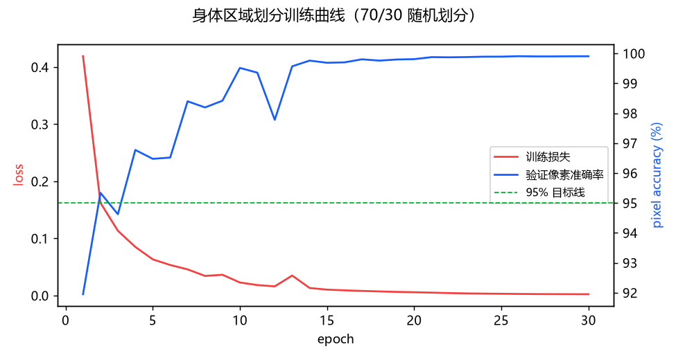
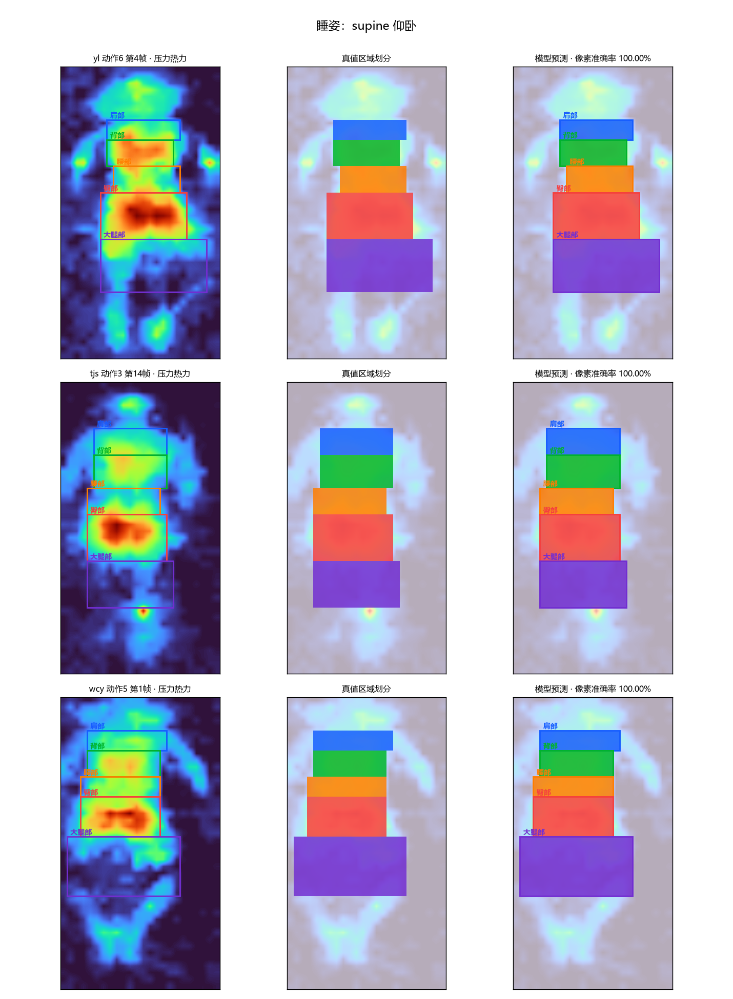
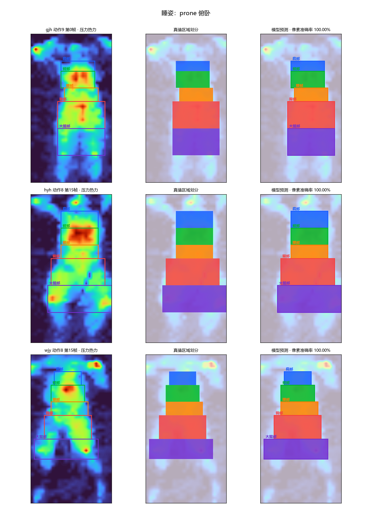
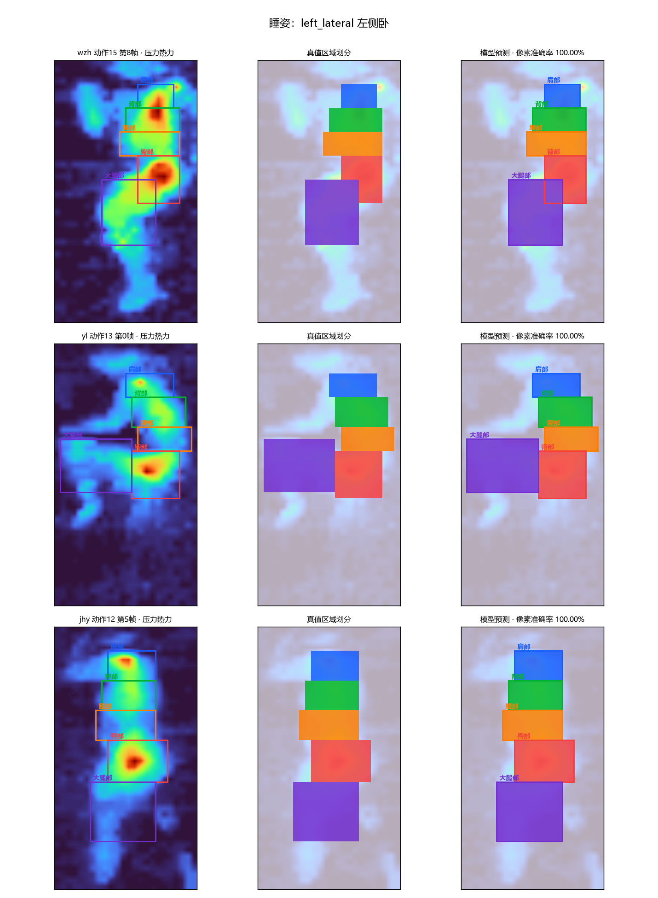
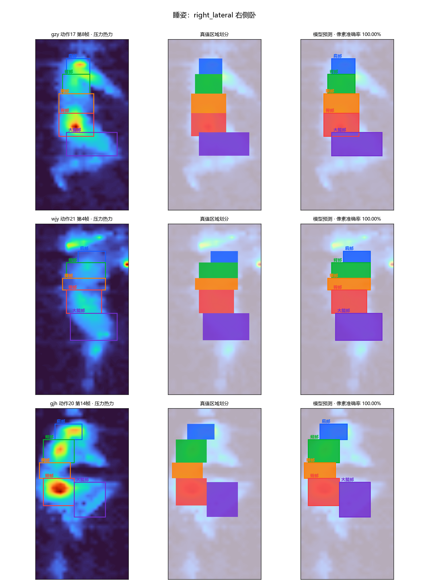
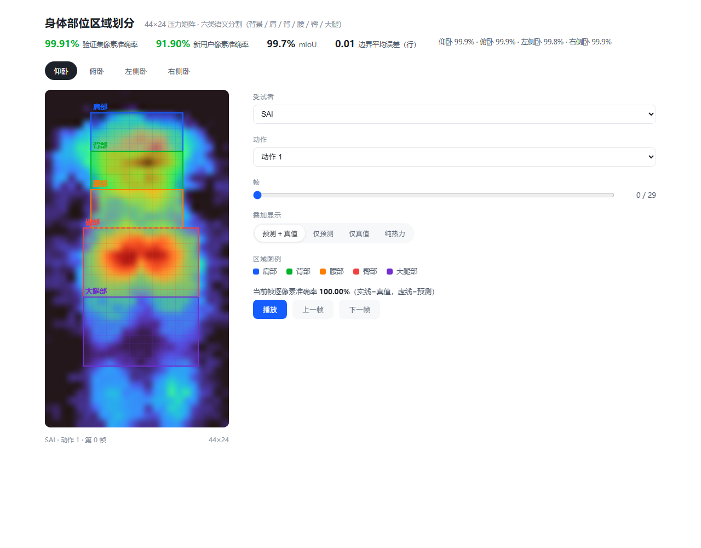

# 身体部位区域划分（body-partition）实验报告

成员 C 任务：在 44×24 压力矩阵上识别并划分 **肩部、背部、腰部、臀部、大腿部**
五个身体区域（小腿部仅 3 人有标注，按数据集说明不使用）。

## 1. 数据集

- 来源：`智能床垫数据集说明` 中「睡姿 区域划分data/区域划分/data.json」，
  已复制至 `dataset/raw/body_partition_data.json`；
- 规模：**14400 帧 = 20 人 × 21 动作 × 30 帧（俯卧 60 帧）**，四种睡姿各 3600 帧；
- 标注：每帧 24 个数，为 6 个部位矩形的 `(x1,x2)` 与 `(y1,y2)` 坐标；
  第 6 个（小腿）仅前 3 人有效，其余为 `na`，统一弃用；
- 像素类别分布：背景 69.9%、肩 3.4%、背 4.5%、腰 4.3%、臀 7.7%、大腿 10.2%
  （全猜背景可得 ~70% 像素准确率，因此新用户 70% 指标要求模型必须真正学会分割）。

## 2. 算法

参考文献（Davoodnia et al., 2021, *Estimating pose from pressure data for
smart beds with deep image-based pose estimators*）中以**全卷积网络**直接处理
压力图的思路，将任务建模为 **6 类逐像素语义分割**（背景 + 5 区域）：

| 组件 | 设计 |
| --- | --- |
| 网络 | 轻量 U-Net：两级下采样（44×24→22×12→11×6）+ 空洞卷积瓶颈 + 跳跃连接，约 33 万参数，CPU 可训练可推理 |
| 输入归一化 | 逐帧取正值 99 分位缩放到 [0,1]，消除体重 / 枕头基线差异，是跨用户泛化的关键 |
| 标签构建 | 5 个标注矩形渲染为逐像素掩码，矩形外一律背景 |
| 损失 | 类别加权交叉熵（逆平方根频率权重，抑制背景主导） |
| 训练 | AdamW lr 3e-3，batch 256，cosine 退火，最多 30 epoch，按验证像素准确率早停 |

**数据增强**（仅作用于训练划分；说明文档禁止重复使用翻转增强，故不做翻转）：
±2 行 / ±1 列的帧-掩码联合平移、按压力尺度的高斯噪声（3%）、0.9–1.1 增益、
±2% 基线偏移、0.05% 稀疏死点，增强 2 份副本（训练集扩大至 3 倍）。
增强后的训练集保存于 `dataset/processed/body_partition_train_augmented.npz`。

## 3. 结果

### 3.1 随机 70/30 划分（要求验证集准确率 > 95%）

训练 10080 帧（增强后 30240）、验证 4320 帧，按睡姿分层随机划分：

| 指标 | 结果 | 要求 |
| --- | --- | --- |
| **验证集像素准确率** | **99.91%** | > 95% ✔ |
| mIoU | 99.70% | — |
| 区域矩形平均 IoU | 99.54% | — |
| 纵向边界平均绝对误差 | 0.006 行 | — |

分睡姿像素准确率：仰卧 99.94% · 俯卧 99.95% · 左侧卧 99.85% · 右侧卧 99.89%。



### 3.2 新用户泛化（要求准确率 > 70%）

按受试者留出 30%（14 人训练 / 6 人全新用户测试），三个独立种子
（42 / 43 / 44，各自重新划分并重新训练）：

| 指标 | 结果 | 要求 |
| --- | --- | --- |
| **新用户像素准确率** | **91.90% ± 0.36%** | > 70% ✔ |
| mIoU | 73.15% ± 0.96% | — |

各种子明细：

| 种子 | 像素准确率 | mIoU | 矩形 IoU | 边界 MAE（行） | 留出受试者 |
| --- | --- | --- | --- | --- | --- |
| 42 | 91.55% | 72.57% | 70.03% | 0.82 | SAI, dgs, hyh, ltr, whc, wzh |
| 43 | 91.74% | 72.38% | 70.21% | 0.81 | hyh, jhy, ltr, lyp, wcy, zhr |
| 44 | 92.40% | 74.50% | 71.85% | 0.75 | gjh, hyh, lyp, stanl, wcy, whc |

种子 42 逐新用户明细（各 720 帧）：

| 受试者 | 像素准确率 | mIoU |
| --- | --- | --- |
| SAI | 90.54% | 0.719 |
| dgs | 92.74% | 0.770 |
| hyh | 92.14% | 0.747 |
| ltr | 90.30% | 0.668 |
| whc | 91.91% | 0.752 |
| wzh | 91.70% | 0.703 |

三个种子共覆盖 12 名不同的留出受试者，像素准确率均在 90% 上下，无失败个体；
分睡姿准确率各睡姿均衡（如种子 42：仰卧 93.01% · 俯卧 91.71% ·
左侧卧 90.41% · 右侧卧 91.08%）。

## 4. 不同睡姿下的划分效果

| 仰卧 | 俯卧 |
| --- | --- |
|  |  |

| 左侧卧 | 右侧卧 |
| --- | --- |
|  |  |

每行三列：压力热力 + 真值矩形 → 真值区域掩码 → 模型预测掩码与矩形。

## 5. Web 数据展示前端

启动后端后访问 <http://127.0.0.1:5000/body-partition/>：

```powershell
.venv\Scripts\python.exe -m backend.app
```

功能：四种睡姿切换、20 名受试者 × 21 动作 × 逐帧浏览、播放动画、
预测 / 真值 / 纯热力三种叠加模式、当前帧像素准确率实时计算、训练指标一览。



## 6. 复现命令

```powershell
.venv\Scripts\python.exe -m train.body_partition.dataset_prep
.venv\Scripts\python.exe -m train.body_partition.train_partition --split random   # 生产模型 + 95% 指标
.venv\Scripts\python.exe -m train.body_partition.train_partition --split subject  # 新用户 70% 指标
.venv\Scripts\python.exe -m train.body_partition.visualize                        # 本报告中的图
```

产物：

- 模型工件：`backend/models/body_partition.pth`（+ `.metrics.json`）
- 新用户评估：`docs/body-partition/body_partition_subject_eval.json`
- 推理接口：`backend/algorithms/body_partition/inference.py`（`BodyPartitionPredictor`）
- HTTP API：`POST /api/body-partition/predict`、`GET /api/body-partition/sample|catalog|metrics`
